<p align="center">
  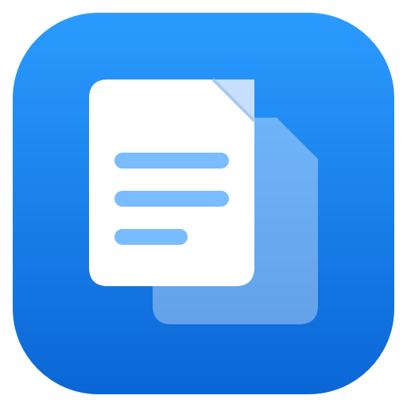
</p>

<h1 align="center">OpenFolio PDF Suite</h1>

<p align="center">
  Suite completa e open source de manipulação de PDF: mesclar, editar, redigir e assinar,<br>
  tudo rodando na sua máquina — sem enviar um arquivo sequer pra nuvem de ninguém.
</p>

---

## Índice

- [Visão geral](#visão-geral)
- [Por trás do projeto](#por-trás-do-projeto)
- [Funcionalidades](#funcionalidades)
- [Demonstração](#demonstração)
  - [Mesclando arquivos](#mesclando-arquivos)
  - [Comprimindo um PDF](#comprimindo-um-pdf)
  - [Marca d'água](#marca-dágua)
  - [Campos de formulário](#campos-de-formulário)
  - [Anotações sobre o visualizador](#anotações-sobre-o-visualizador)
  - [OCR (texto pesquisável)](#ocr-texto-pesquisável)
  - [Redigir e sanitizar](#redigir-e-sanitizar)
  - [Assinatura digital](#assinatura-digital)
- [Requisitos](#requisitos)
- [Como instalar](#como-instalar)
- [Como rodar](#como-rodar)
- [Tecnologias utilizadas](#tecnologias-utilizadas)
- [Estrutura do projeto](#estrutura-do-projeto)
- [Testes](#testes)
- [Contribuição](#contribuição)
- [Licença](#licença)

## Visão geral

O OpenFolio PDF Suite é um aplicativo desktop (Windows/Linux/macOS, via PySide6) que reúne as
operações de PDF mais comuns — mesclar, dividir, comprimir, proteger, converter, preencher,
anotar, redigir, assinar — sem depender de ferramentas online, sem enviar seus arquivos para
servidor nenhum e sem paywall. Tudo roda localmente, na sua máquina.

<p align="center">
  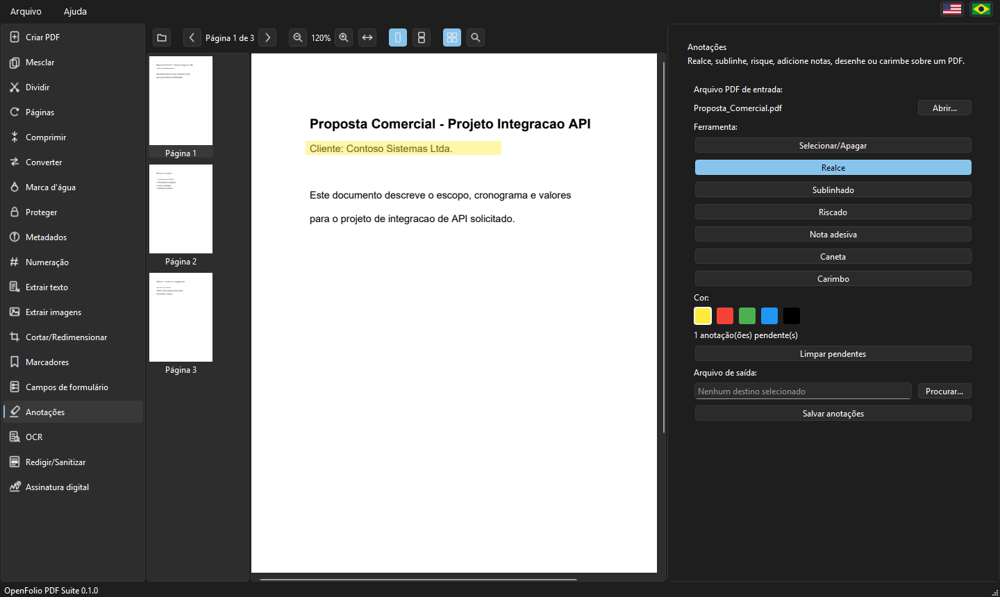
</p>

A navegação é feita por uma barra lateral com ícone e descrição de cada ferramenta. No centro
fica o visualizador — sempre visível, com miniaturas, zoom, rolagem contínua ou página única e
busca de texto — e é nele que você desenha as anotações e marca as áreas de redação
diretamente sobre a página. À direita, cada seção tem seus próprios campos de entrada/saída e
botão de ação.

## Por trás do projeto

Esse projeto segue um padrão que se repete nas coisas que eu construo: toda vez que preciso de
uma ferramenta, a primeira pergunta é se dá pra fazer uma versão que rode local, sem depender
de um servidor de terceiros guardando meus arquivos, sem assinatura mensal e, de preferência,
aberta pra quem quiser ler o código ou contribuir. O
[CofreDeSenhas](https://github.com/dcCarreto/CofreDeSenhas), por exemplo, nasceu da mesma
lógica: um gerenciador de senhas com cofre local criptografado (AES-256-GCM) em vez de um
serviço na nuvem guardando a chave de tudo.

Com o OpenFolio não foi diferente. Comecei pelo básico — mesclar, dividir, comprimir — e fui
adicionando ferramenta por ferramenta, sempre em uma branch separada e sempre com testes
cobrindo o comportamento esperado antes de considerar qualquer coisa pronta, até chegar num
visualizador integrado com anotação, OCR, redação real e assinatura digital de verdade. A
metodologia se repete em cada ferramenta nova: preferir uma biblioteca madura e bem mantida a
reinventar algo sensível a erro sutil — por isso a assinatura digital usa `pyhanko` e o OCR usa
o Tesseract, em vez de eu tentar resolver na unha algo onde um bug silencioso pode custar caro
(um PDF "assinado" que não valida, uma redação que deixa dado recuperável por baixo).

## Funcionalidades

| Seção | O que faz |
| --- | --- |
| 🆕 Criar PDF | Cria um novo PDF em branco, com uma ou mais páginas, no tamanho que você escolher |
| 📄 Mesclar | Combina vários PDFs em um único arquivo, na ordem que você definir |
| ✂️ Dividir | Separa um PDF em vários arquivos menores (uma ou N páginas por arquivo) |
| 🔃 Páginas | Rotaciona, reordena ou remove páginas de um PDF |
| 🗜️ Comprimir | Reduz o tamanho de um PDF recomprimindo conteúdo e removendo objetos duplicados |
| 🖼️ Converter | Converte entre PDF e imagens, Word/Excel/PowerPoint e PDF, e XML e PDF |
| 💧 Marca d'água | Adiciona um texto de marca d'água (opacidade, tamanho e rotação configuráveis) |
| 🔒 Proteger | Protege um PDF com senha (AES-256), ou remove a senha de um PDF protegido |
| 🏷️ Metadados | Lê e edita título, autor, assunto e palavras-chave de um PDF |
| 🔢 Numeração | Adiciona números de página no rodapé, com página inicial configurável |
| 📝 Extrair texto | Extrai todo o texto de um PDF para um arquivo `.txt` |
| 📷 Extrair imagens | Extrai as imagens embutidas nas páginas de um PDF, em seus formatos originais |
| 📐 Cortar/Redimensionar | Corta margens ou redimensiona as páginas de um PDF para um novo tamanho |
| 🔖 Marcadores | Monta um sumário de navegação (outline) com título e página de destino |
| 🧾 Campos de formulário | Adiciona campos de formulário **interativos** (texto ou caixa de seleção) — o PDF resultante é preenchível em qualquer leitor |
| 🖍️ Anotações | Realce, sublinhe, risque, adicione notas, desenhe à mão livre ou carimbe direto sobre a página, no próprio visualizador |
| 🔍 OCR | Reconhece o texto de páginas escaneadas (via Tesseract) e gera um PDF pesquisável, com o texto invisível posicionado exatamente sobre a imagem original |
| ⬛ Redigir/Sanitizar | Apaga áreas de um PDF de forma irreversível (rasterizando a página inteira) e remove metadados, JavaScript e anexos embutidos |
| ✒️ Assinatura digital | Assina um PDF com selo visível e assinatura criptográfica de verdade (CMS/PKCS#7), usando um certificado .pfx real ou um certificado de teste gerado na hora |

## Demonstração

As capturas abaixo foram feitas rodando a aplicação de verdade: arquivos de exemplo reais são
mesclados, comprimidos e processados, e os resultados (tamanho de arquivo, mensagens de sucesso)
vêm da execução real das operações — não são mockups.

### Mesclando arquivos

Três relatórios mensais são adicionados à lista, na ordem em que devem aparecer no PDF final, e
um arquivo de saída é escolhido:

<p align="center">
  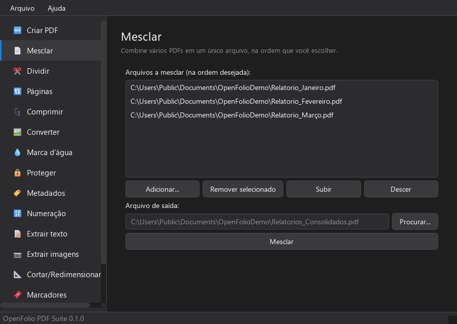
</p>

Ao clicar em **Mesclar**, os três arquivos são combinados em um único PDF de verdade:

<p align="center">
  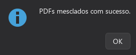
</p>

### Comprimindo um PDF

Um contrato de 25 páginas é escolhido como entrada:

<p align="center">
  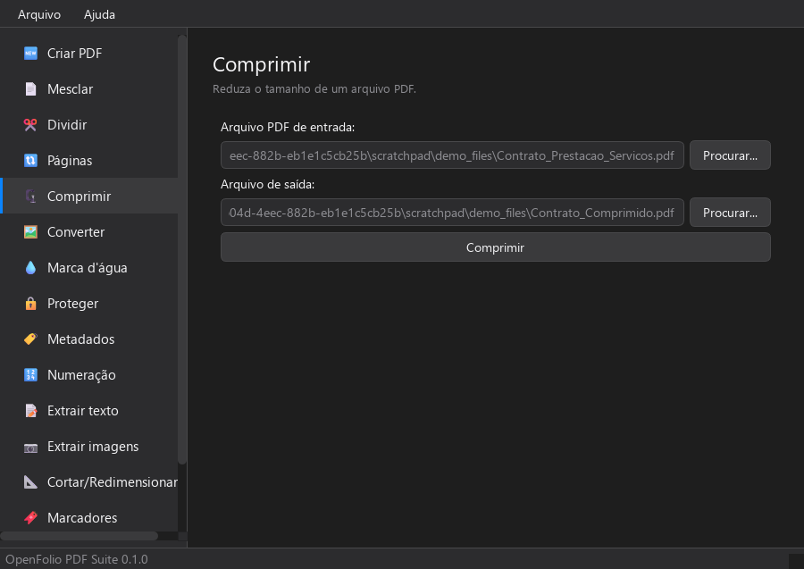
</p>

O resultado mostra o tamanho real antes e depois da compressão:

<p align="center">
  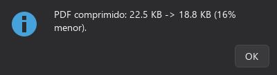
</p>

### Marca d'água

Texto, opacidade, tamanho de fonte e rotação são configuráveis antes de aplicar sobre todas as
páginas do PDF:

<p align="center">
  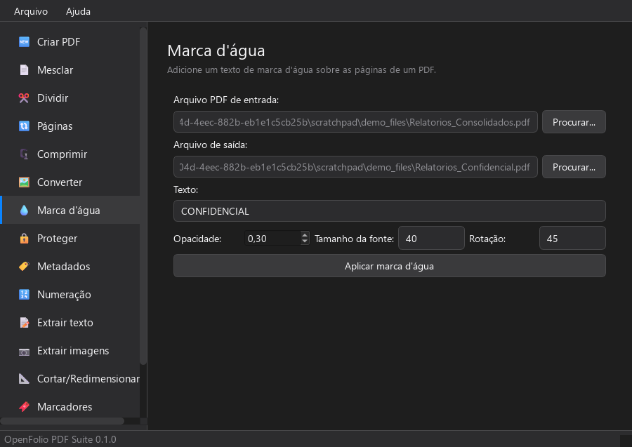
</p>

### Campos de formulário

Diferente de um texto carimbado na página, esta ferramenta cria um campo **AcroForm** de
verdade: o PDF resultante pode ser aberto em qualquer leitor (Adobe Reader, navegador, etc.) e o
campo pode ser clicado e preenchido normalmente.

<p align="center">
  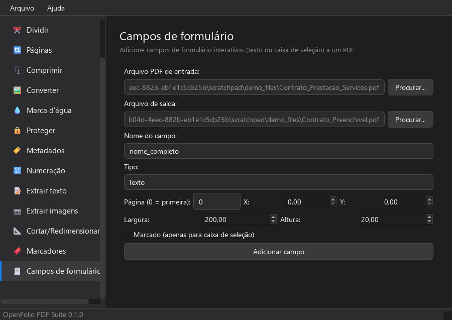
</p>

### Anotações sobre o visualizador

A ferramenta de realce está selecionada e o trecho "Cliente: Contoso Sistemas Ltda." foi
marcado direto na página, arrastando o mouse sobre o visualizador — sem precisar de um editor
separado:

<p align="center">
  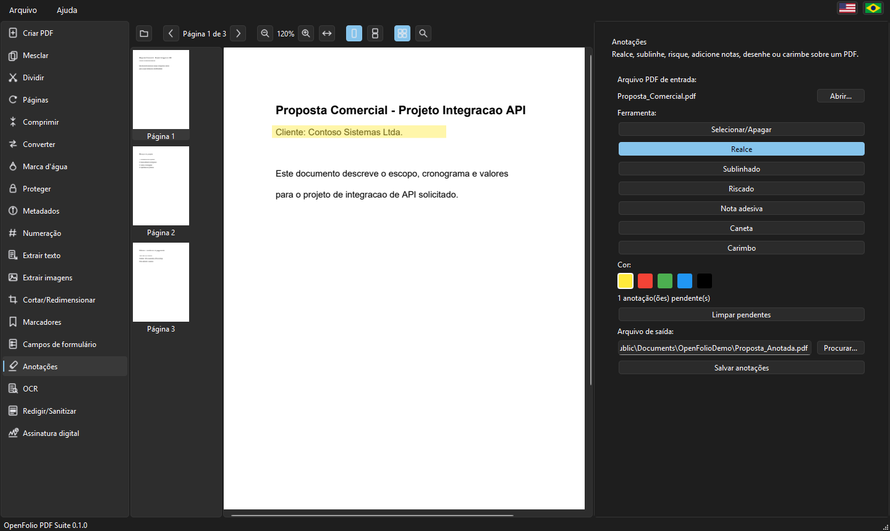
</p>

### OCR (texto pesquisável)

Um contrato gerado a partir de texto puro (sem camada pesquisável) é reconhecido pelo
Tesseract, que já foi detectado automaticamente com o idioma instalado:

<p align="center">
  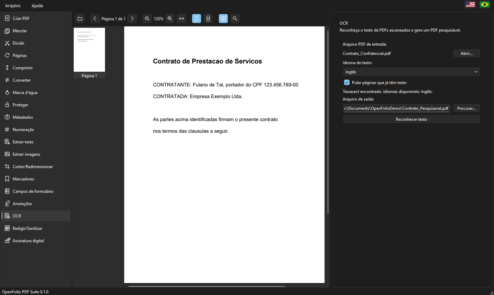
</p>

### Redigir e sanitizar

Uma linha inteira contendo o CPF do contratante é marcada no visualizador; ao aplicar a
redação, a página inteira é rasterizada — não sobra texto nem vetor recuperável por baixo do
retângulo preto:

<p align="center">
  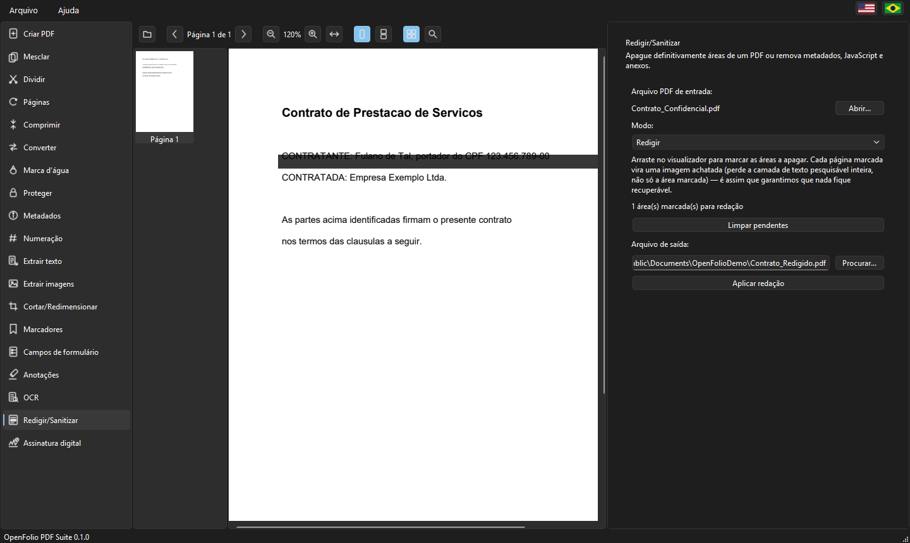
</p>

### Assinatura digital

Um termo de aceite foi assinado com um certificado de teste gerado na hora: o selo visível
aparece no canto inferior direito da página, e a verificação confirma a identidade do
signatário, a data da assinatura e que o documento continua íntegro:

<p align="center">
  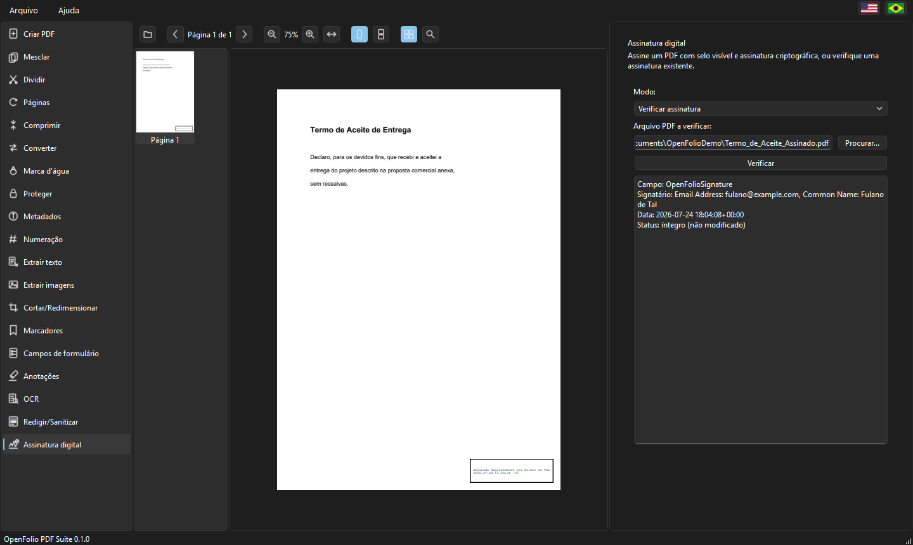
</p>

## Requisitos

- Python 3.10 ou superior
- Windows, Linux ou macOS (interface gráfica via PySide6/Qt)
- [LibreOffice](https://www.libreoffice.org/) (opcional) — se instalado, a conversão de
  Word/Excel/PowerPoint para PDF preserva a formatação original. Sem ele, a conversão ainda
  funciona, mas com uma formatação básica (só texto e estrutura, via Python puro).
- [Tesseract OCR](https://github.com/tesseract-ocr/tesseract) (opcional, necessário só para a
  ferramenta de OCR) — a aplicação detecta a instalação automaticamente e lista os idiomas de
  reconhecimento disponíveis.

## Como instalar

```bash
git clone https://github.com/dcCarreto/openfolio-pdf-suite.git
cd openfolio-pdf-suite
pip install -e .
```

Isso instala o pacote em modo editável junto com todas as dependências (`pypdf`, `PySide6`,
`pypdfium2`, `Pillow`, `reportlab`, `cryptography`, `python-docx`, `openpyxl`, `python-pptx`,
`pytesseract`, `pyhanko`).

## Como rodar

```bash
python main.py
```

A janela principal abre em modo escuro, com a aba **Criar PDF** selecionada por padrão. Basta
escolher a ferramenta desejada na barra lateral.

## Tecnologias utilizadas

| Biblioteca | Uso |
| --- | --- |
| [pypdf](https://pypdf.readthedocs.io/) | Leitura, escrita e manipulação de PDFs (base de quase todas as operações) |
| [PySide6](https://doc.qt.io/qtforpython/) | Interface gráfica (Qt para Python) |
| [pypdfium2](https://pypdfium2.readthedocs.io/) | Renderização de páginas PDF em imagens (visualizador, thumbnails, conversão PDF → imagem) |
| [Pillow](https://pillow.readthedocs.io/) | Leitura/escrita de imagens (conversão imagem → PDF, extração de imagens) |
| [reportlab](https://www.reportlab.com/) | Geração de conteúdo vetorial (marca d'água, numeração de página, campos de formulário, redação, fallback de conversão do Office/XML) |
| [cryptography](https://cryptography.io/) | Criptografia AES-256 usada na proteção por senha e geração do certificado de teste da assinatura digital (via `pypdf[crypto]`) |
| [python-docx](https://python-docx.readthedocs.io/) | Leitura de documentos Word (.docx) no fallback de conversão para PDF |
| [openpyxl](https://openpyxl.readthedocs.io/) | Leitura de planilhas Excel (.xlsx) no fallback de conversão para PDF |
| [python-pptx](https://python-pptx.readthedocs.io/) | Leitura de apresentações PowerPoint (.pptx) no fallback de conversão para PDF |
| [pytesseract](https://github.com/madmaze/pytesseract) | Integração Python com o Tesseract OCR |
| [pyhanko](https://github.com/MatthiasValvekens/pyHanko) | Assinatura digital de PDF (CMS/PKCS#7) e verificação de integridade |
| [LibreOffice](https://www.libreoffice.org/) (opcional, externo) | Conversão de Word/Excel/PowerPoint para PDF com formatação fiel ao original |
| [Tesseract OCR](https://github.com/tesseract-ocr/tesseract) (opcional, externo) | Motor de reconhecimento de texto usado pela ferramenta de OCR |

## Estrutura do projeto

```text
core/            Lógica de manipulação de PDF, sem nenhuma dependência de UI
  base.py          Classe base PDFOperation
  merge.py, split.py, pages.py, compress.py, convert.py, ...
  annotations.py   Anotações reais (Highlight/Underline/StrikeOut/Ink/Stamp) via pypdf
  ocr.py           Reconhecimento de texto (Tesseract) com camada de texto invisível
  redaction.py     Redação real (rasterização) e sanitização de PDFs
  signature.py     Assinatura digital (pyhanko) e verificação de integridade

ui/              Interface gráfica (PySide6)
  main_window.py       Janela principal: monta a sidebar e as 19 seções
  theme.py             Tema escuro único, inspirado no macOS
  icon.py              Ícone da aplicação (renderizado a partir de assets/logo.svg)
  document_session.py  Sessão compartilhada do PDF aberto no visualizador
  annotation_state.py  Estado compartilhado da ferramenta de anotações
  redaction_state.py   Estado compartilhado da ferramenta de redação
  viewer/              Visualizador central: renderização, miniaturas, busca, zoom
  pages/               Uma classe de página por ferramenta (MergePage, CompressPage, ...)
  widgets/             Widgets reutilizáveis (FilePicker, FileListEditor, PageContainer)

tests/           Testes pytest (um arquivo por operação de core, + teste de fumaça da UI)

assets/          Ícone/logo da aplicação e screenshots usados neste README
```

Cada operação em `core/` é independente da UI: pode ser usada diretamente em um script Python,
sem precisar abrir a interface gráfica. Por exemplo:

```python
from core.merge import MergePDF

MergePDF().run(
    ["relatorio_janeiro.pdf", "relatorio_fevereiro.pdf"],
    "relatorios_consolidados.pdf",
)
```

## Testes

```bash
pip install -e ".[test]"
pytest
```

Todos os módulos de `core/` têm testes cobrindo o comportamento esperado, e há um teste de
fumaça que garante que a janela principal monta todas as seções sem erros.

## Contribuição

Contribuições são bem-vindas. Veja [CONTRIBUTING.md](CONTRIBUTING.md) para mais detalhes.

## Licença

Distribuído sob a licença [MIT](LICENSE).
